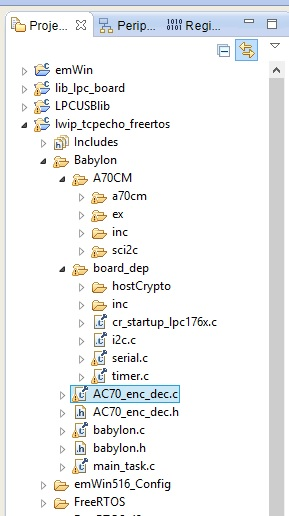
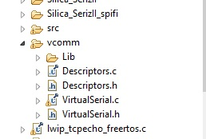
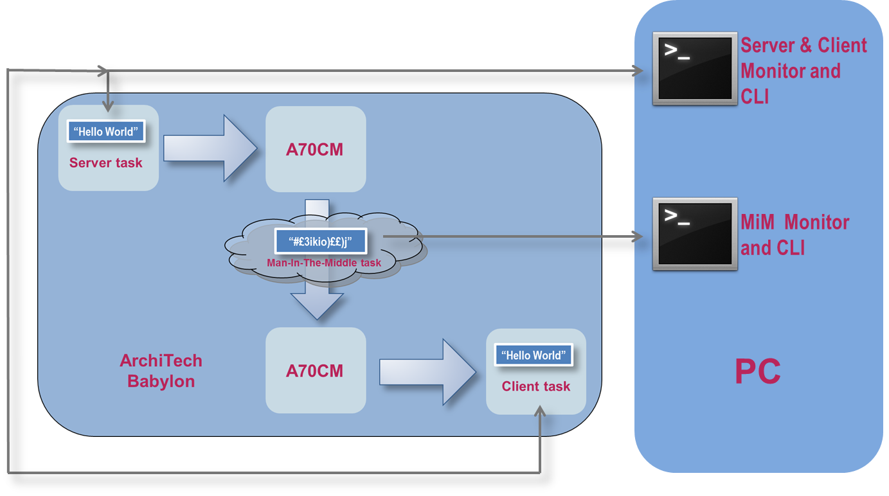
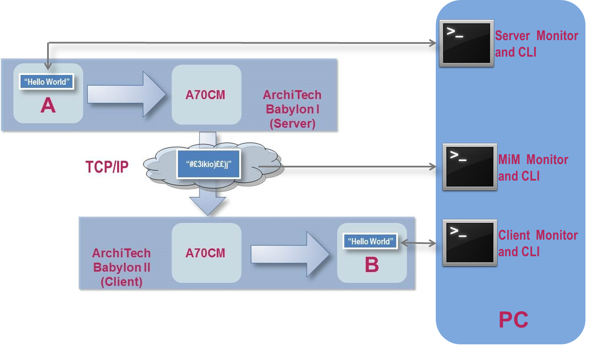

.. index:: PrjFiles

Firmware specification
**********************

Firmware overview
-----------------

| The Babylon AC70M demo firmware has been developed using **AC70M Host API library** and **SCI2C library** and performs RSA and AES-CBC encryption/decryption functions
| It is designed only for evaluation purposes and to demonstrate how to use AC70M API functions. 
| End-user applications can use these examples to perform encryption/decryption functions, but it's mandatory that customers follow standard specifications to improve security data exchange. 
| Some of these specification can be found, for example, at **NIST** National Institute of Standards and Techology, section Computer Security Resource Center `CSRC <http://csrc.nist.gov/>`_
| 

Firmware restrictions
---------------------

| The Babylon AC70M demo firmware assumes the following restrictions:
| • Authentication Process assumes both Client than Server has same RSA certificate inside. No Certificate exchange is performed
| • The demo program use default NXP Certificate for Autentication Process
| • Authentication process is started from Client and uses a simple AES KeyA-KeyB exchange check. 
| • The AES session Key is exchanged after authentication success.
| • AES key is generated using secure wrapping algoritm RFC3394
| • The user's text messages are sent from Server to Client (max lenght 64 char)
| • All messages are 128 bytes fixed-length
| • Signed user's messages uses SHA1 digital signature, stored inside of last 20 bytes of each message (from position 109 to position 128). *(more details at paragraph 19.2.3.1 - Secret Key Electronic Signatures on* `this link <http://csrc.nist.gov/publications/nistpubs/800-12/800-12-html/chapter19.html>`_ *)*
| • To change AES session key, you must restart Authentication Process.
| • AES key generation function is ONLY FOR DEBUG. Do not use for end-user application
| • LAN mode has one board as Server and one board as Client, 3 terminal instance are needed
| 

Main firmware features
----------------------

By using two PC terminal software connected to Babylon board (see :ref:`saset`), you can perform:

 - Main settings of application parameters
 - Configure Man-In-The-Middle performance
 - Launch Athentication Process
 - Write plain custom messages (maximun 64 character) and send its to client
 - Check results of sending

 .. _macros:
 
Operation mode macros
---------------------

See at file "task_ac70.h" in project folder "\\AC70M\\inc"
You can find these macros

::

 #define AC70_TASK 0   //enable original main_task for AC70M Host Api demo application 

 #if AC70_TASK			//if Host api demo, no other task can be enabled
  #define IP_TASK 0
  #define VCOMM_TASK 0
  #define BABYLON_TASK 0

 #else					//not api demo, select operation mode
  #define VCOMM_TASK 1
  #define BABYLON_TASK 1
  #define IP_TASK 0		//IP task enable/disable

		#if IP_TASK
			#define UDP_SERVER 1
			#define UDP_CLIENT !UDP_SERVER
		#else
			#define UDP_SERVER 0
			#define UDP_CLIENT 0
		#endif
 #endif

 
Macro **AC70_TASK** do not set to 1, only for AC70M API demo

Macro **IP_TASK** can be set 1 for LAN operation. 

**By default the firmware comes compiled in Stand-Alone operation mode (IP_TASK = 0).**

To switch to LAN mode, you must set IP_TASK = 1, an then configure Server os Client compilation by setting:

|  UDP_SERVER 1 = Server application 
| **or**
|  UDP_SERVER 0 = Client application 

You can also find these other macros:

::

 #define LCD_TASK 1
 #define POLL_TASK 0
 #define JEN_TASK 0
 
| LCD_TASK enable/disable GUI interface task
| POLL_TASK and JEN_TASK must be set to 0
| 

Project structure
-----------------

The project "lwip_tcpecho_freertos" include the following specifing folders for AC70M application

• **Babylon** – main file folder
	• **AC70M** folder Host API and SCI2C library
	• **board_dep** folder SHA1 HostCrypto source files and other include file 
	• **babylon.c** source file Main Application Tasks
	• **AC70_enc_dec.c** source file AC70 host API interface functions

• **vcomm** – Virtual Comm Port and Man-In-The-Middle file folder
	• **VirtualSerial.c** source file Main Application Task

Brief of firmware performance
-----------------------------

| The firmware will include a minimal example how to initialize the AC70M and use Host API functions. 
| It include also the source files of these Host API, the source files of SCI2C library and a layer to interface main application tasks with API functions. 
| In Stand Alone operation mode, there is only one Main Menu that will configure both Server and Client
| Also the results of all operation (Settings, Authentication, Message exchange) are shown an same terminal window
| As a demo of text messages, they are sent by Server Task to Client Task

| Using LAN configuration, Server and Client are on two separate boards. Each board has your own terminal connection, and show same configuration menu. 
| In this case, only the needed selections from Server or Client menu gives your own effects. Unneeded parameters will ignored.
| The LAN operation mode is designed for getting closer to real world- Client/Server interaction using 2 boards 
| For mode detail about LAN mode see :ref:`lanset`

  
Project and tools download
--------------------------

Instructions for tools and firmware installation can be found at Silica ArchiTech page under SerizII project section. Registration is needed to access at download section.
Click `here <http://www.silica.com/architech.html>`_ to go to ArchiTech main page.

