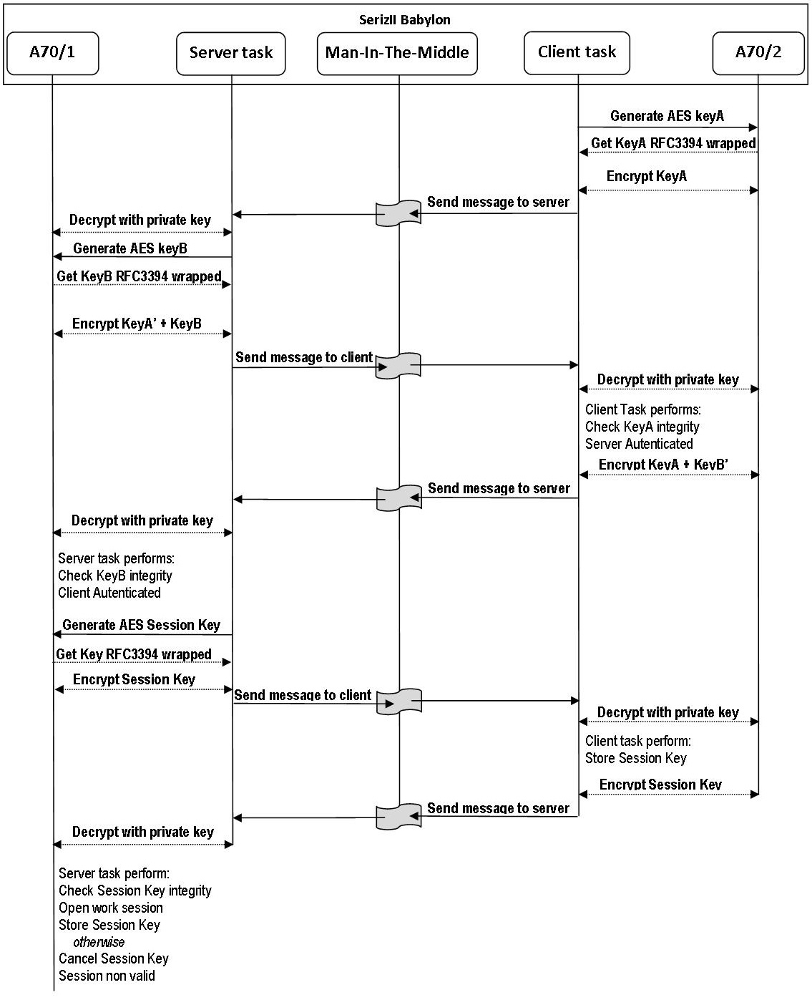
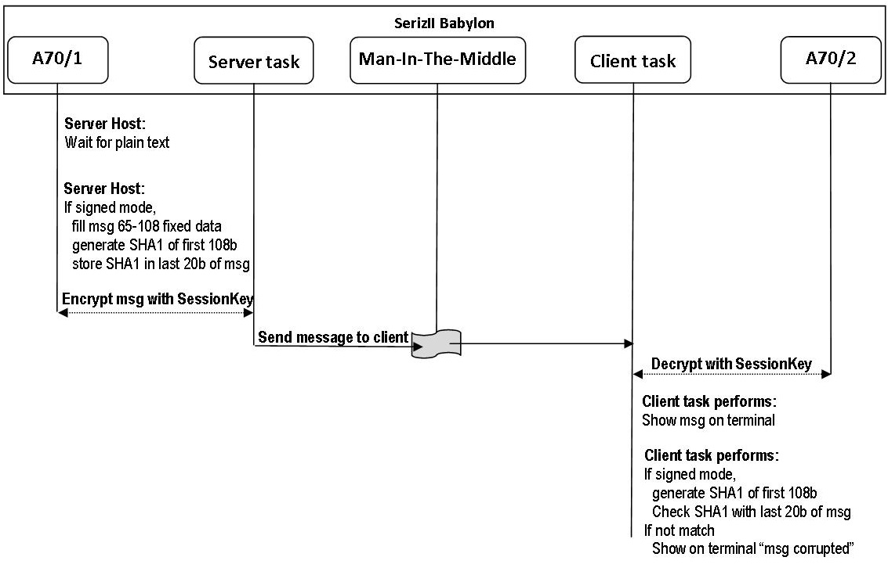

.. index:: flow

.. _more:

More about firmware
-------------------

In this chapter you can find a flow of main functionallity of Babylon AC70M firmware.
The description is referred to Stand-Alone operation mode. 

*For LAN mode, remember that Server and Client are two separate boards*

ATHENTICATION PROCESS 
*********************

First of all, you must open a work session by performing Authentication Process (:ref:`auth`)

**ALL ENCRYPTION ARE MADE BY RSA PUBLIC KEY**

.. important ::
 | **The "gray flag" means Man-In-The-Middle activity:** 
 | **- if active,it intercept message and perform actions as your settings**
 | **- if inactive, it is skipped and messages comes out directly**
 

*Step by step description of authentication process*

| **1.** Client task generate one authentication KeyA wrapped with RFC3394 algo
| **2.** Client task encrypt the KeyA with your RSA Public key, then send to Server
| .. *2.1 If Man-In-The-Middle is active, the intercept message and perform actions as your settings*
| **3.** Server task receive the message, decrypt it, generate a second AES session KeyB also wrapped
| **4.** Server task attach KeyB to the incoming message, encrypt with your RSA Public key, then send to Client task
| .. *4.1 If Man-In-The-Middle is active, the intercept message and perform actions as your settings*
| **5.** Client task decrypt incoming message, check KeyA integrity; if ok, **Server is authenticated**.
| **6.** Client task encrypt message as is with your RSA Public key, then feedback to Server task
| .. *6.1 If Man-In-The-Middle is active, the intercept message and perform actions as your settings*
| **7.** Server task receive the message, decrypt it, check KeyB integrity; if OK, **Client is authenticated**
| **8.** Server task generate a new AES key (session key), encrypt with your RSA Public key and send to Client task
| .. *8.1 If Man-In-The-Middle is active, the intercept message and perform actions as your settings*
| **9.** Client task decrypt incoming message, store session Key as received from Server task
| **10.** Client task encrypt session Key as is with your RSA Public key, then feedback to Server task
| .. *10.1 If Man-In-The-Middle is active, the intercept message and perform actions as your settings*
| **11.** Server task decrypt incoming message, chek session key integrity; **if OK, a valid work session is opened**.
| 

SENDING/RECEIVENG MESSAGES 
**************************

After typing ‘3’ on the main menu of Server, sending mode is entered

.. important ::
 | **The "gray flag" means Man-In-The-Middle activity:** 
 | **- if active,it intercept message and perform actions as your settings**
 | **- if inactive, it is skipped and messages comes out directly**

*Step by step description of sending messages*
 
| **1.** Server task wait for plain text input(max length 64)
| **2.** if signed, Server task generate SHA1 signature and store in last 20 bytes of message
| **3.** Server task encrypt message with AES session key.
| .. *3.1 If Man-In-The-Middle is active, the intercept message and perform actions as your settings*
| **4.** Client task decrypt incoming message with AES session key
| **5.** if signed, Client task extract last 20 bytes of message, then generate SHA1 signature of remaining bytes
| **6.** Client task show decrypted message on terminal.
| **7.** if signed, Client task compare your own SHA1 signature with that just received from Server task
| **8.** If sighature don't match, Client task show on terminal "message corrupted" 
|

.. note ::
 | **- It assumes that both AC70 are same RSA certificate inside (the demo will use default NXP)**
 | **- All messages are 128 byte fixed length**
 | **- Plain text is stored on first 64 bytes of messages. All unused bytes are filled with fixed pattern (except for last 20 if signed message)**
 | **- KeyA, KeyB, Session Key are stored at fixed position of the message. Both server and client know the relative position.**
 

WORKING WITH LAN
****************
 
LAN operation mode of firmware has Server and Client on two separate SerizII board. All messages (even authentication than user's text) are exchanged using UDP.
For correct setup, see :ref:`lanset`

LAN AUTENTICATION
*****************

Lan Authentication will start automatically from Babylon IP CLIENT, by typing '2' from main menu.
Before this, you must set key lengh in Client configuration sub menu. 
Type '1' from main menu, then select '1' for 128, '2' for 256 

After this, to start a work session, both Server and Client must be in the Authenticate state.

LAN MESSAGE
***********

User's plain text mesages are exchanged using this flow
To send plain text, type '3' from Babylon IP SERVER.

