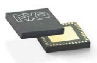
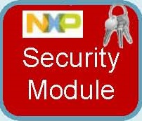

.. SerizII_AC70M documentation master file, created by
   sphinx-quickstart on Mon Sep 15 11:59:03 2014.
   You can adapt this file completely to your liking, but it should at least
   contain the root `toctree` directive.

Welcome to Babylon's board documentation!
=========================================

:Version: 1.00
:Copyright: (C)2014 Silica an Avnet company
:Date: 15 september 2014

NXP Secure Authentication Microcontroller AC70M
-----------------------------------------------

.. index:: index

**INTRODUCTION**
----------------

The Silica SerizII with AC70M add-on board is designed to evaluate NXP A7001 ADPU secure module.
The firmware will perform a sample demo application between LPC4350 cpu, AC70M Host API library and SCI2C library.
It show the use of main basic AC70M API functions for AES encryption/decription (using CBC mode) and a sample of authenticatio process between Server and Client. In addition, a Man-In-The-Middle simulator is implemented to change data and check security results.
The firmware can be compiled in many different functionallity by setting appropriate macros define: 

============ =================================================================================
Mode	     Main features
============ =================================================================================
Stand Alone  Use only 1 SerizII board with AC70M add-on. Messages are exchanged between 
             the two AC70M onboard using RTOS queue. Man-In-The-Middle simulator
LAN Client   Use on SerizII Babylon client board. 
             The messages are exchanged to Server using UDP queue
LAN Server   Use on SerizII Babylon server board. 
             The messages are exchanged to Client using UDP queue. 
             Man-In-The-Middle simulator
============ =================================================================================

See at "Firmware Specification" paragraph for how to configure macros

Developement tools
******************

Firmware was developed using:
LPCXpresso 6-1-2 free version. For installation and configuration of the project, follow instruction inside :ref:`quick`

Document references
*******************

The AC70M reference documentation is available only under NDA agreement. Contact Silica for more informations about.

Contents:

.. toctree::
   :maxdepth: 2

   qs
   PrjFiles
   using
   flow

