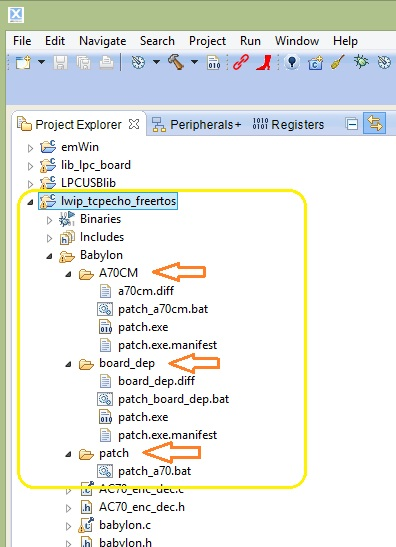
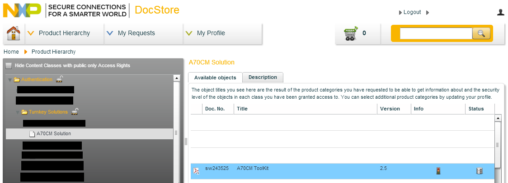
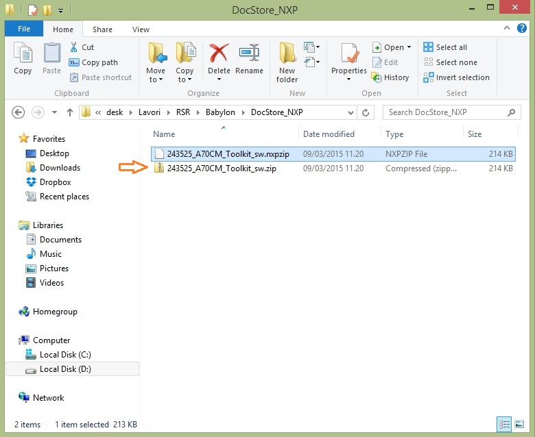
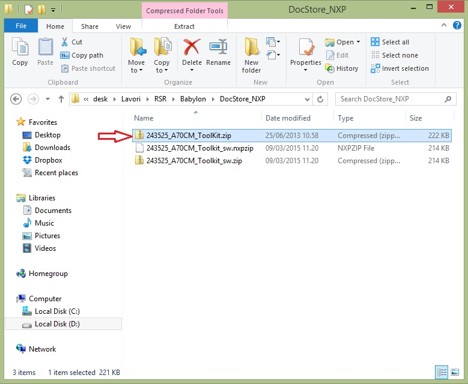
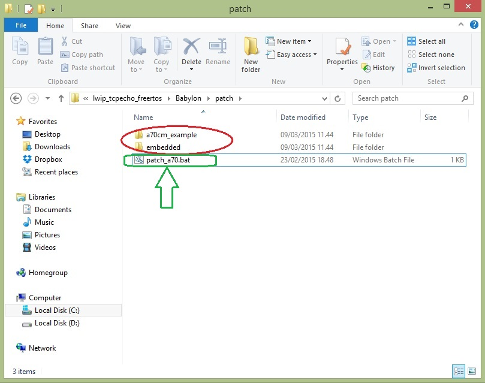
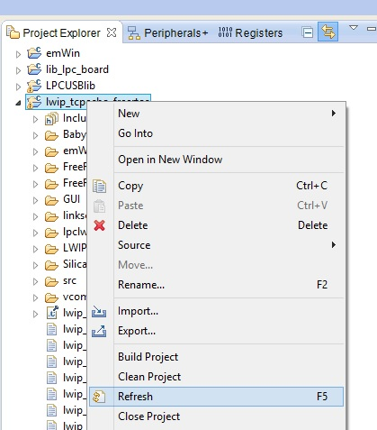
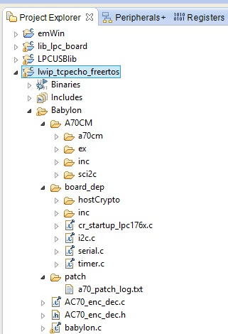

.. index:: patch

.. _patch:

Patching NXP A70CM libraries
----------------------------

This chapter will show how to import and patch original NXP library for Babylon project

Babylon project comes with folders **a70cm** and **board_dep** containig only patch files required for patching original NXP libraries.
(see image below)

Import library
**************

Before compile Babylon application firmware, you must download NXP A70cm example library.
To do this, make a registration at link https://www.docstore.nxp.com 
When you receive authorization from NXP, you can download the A70cm example library as figure below

Reneame the downloaded file "243525_A70CM_Toolkit_sw.nxpzip" into **"243525_A70CM_Toolkit_sw.zip"**

unzip the file **"243525_A70CM_Toolkit_sw.zip"** just renamed; your NXP library folder content should be as figure below:

see at file **"243525_A70CM_ToolKit.zip"**; unzip this file into project folder "**<workspace>\\lwip_tcpecho_freertos\\Babylon\\patch**" located inside your workspace 

double click on file "**patch_a70.bat**" (green circled)

and follow screen instructions.

When batch process ends, open LPCXpresso, right click on "lwip_tcpecho_freertos" and select "Refresh" (sse image below)

Now you can see the needed library files patched

Follow :ref:`runp` to compile and run babylon project

.. note ::
 you can find the result of batch process inside file "**a70_patch_log.txt**"
 
 .. image:: _static/patch/log.jpg
 

 

