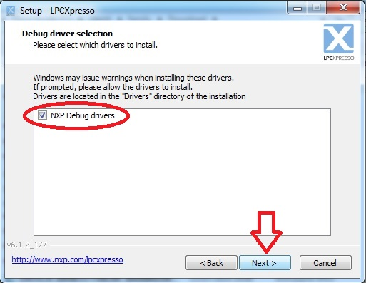
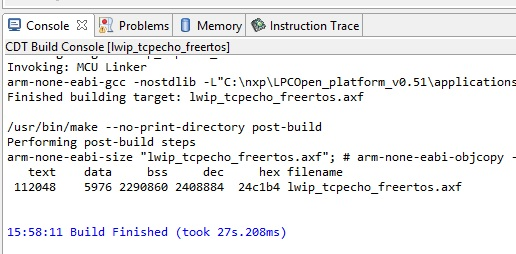

.. index:: qs

.. _quick:

Quick start guide
-----------------

This guide will provide instructions to install the development environment and all the libraries needed to compile and debug the demo firmware SerizII AC70M
The main steps are:

- Install and register LPCXpresso IDE
- Install LPCopen
- Install EmWin
- Install firmware and configure LPCXpresso IDE

Load and install LPCXpresso
***************************

Download LPCXpresso 6.1.2 ( or later ) https://s3.amazonaws.com/LPCXpresso6/LPCXpresso_6.1.2_177.exe

- Install and register the software (this will enable to work up to 256KB code size);
- The tools will install under the C:\\NXP subdirectory

During installation tool will ask for debug driver install:

And then, Windows Security will ask about reliability of software driver:

- CDM driver package (tree times)
- Generic NXP driver (one times)

Click on "Install" to confirm

When all driver installation ends, click next

Select checkbox as figure above, then click finish.

When LPCXpresso will open, follow free license registration instructions to work up to 256KB code size (see figure below)

After activation success, click OK to restart LPCXpresso.

The "welcome" screen will appear, LPCXpresso succesfully installed

Load and install LPCOpen
************************

Download lpcOpen http://www.lpcware.com/system/files/LPCOpen_platform_v0.51.zip

Extract the the zip content and put under the C:\\NXP subdirectory. See figure below.

Load and install EmWin
**********************

Download emWIn (not included for License issues) http://www.lpcware.com/system/files/NXP_emWin516_libraries_0.zip

- Unzip the download compressed folder

- Run the resulting file NXP_emWin516_librariers.exe, which will self extract a file named ‘NXP_emWin516_libraries.zip ‘ (located by default in C:\\NXP\\emWin\\)
- Extract the content of NXP_emWin516_libraries.zip, which is the folder NXP_emWin516_libraries.

(sse figure above)

- Copy the contents of this folder to C:\\NXP\\LPCOpen_platform_v0.51\\software\\emWin

*(it is important to follow the exact directory path, inside the project some files have relative reference to files included into the LPCOpen_platform_v0.51, any path change requires changes in this references)*

Run the Babylon AC70M demo
**************************

Open LPCXpresso6, create a workspace **SerizII_AC70M_LPC** in the directory C:\\nxp\\LPCOpen_platform_v0.51\\applications\\lpc18xx_43xx\\examples\\

*(it is important to follow the exact directory path, inside the project some files have relative reference to files included into the LPCOpen_platform_v0.51, any path change requires changes in this references)*

Import the **babylon_1_0.zip** into the workspace

The project is loaded into the workspace

Configuring emWin
^^^^^^^^^^^^^^^^^

select the “LPC43xx” configuration as active

Configuring lib_lpc_board
^^^^^^^^^^^^^^^^^^^^^^^^^

select the "Silica_SerizII" configuration as active

Configuring LPCUSBlib
^^^^^^^^^^^^^^^^^^^^^

select the "Silica_SerizII" configuration as active

.. image:: _static/qs/usb_conf.jpg

Configuring lwip_tcpecho_freertos
^^^^^^^^^^^^^^^^^^^^^^^^^^^^^^^^^

select as active the “Silica_SerizII_spifi”

Compile and load firmware
^^^^^^^^^^^^^^^^^^^^^^^^^

Select the **lwip_tcpecho_freertos**  project, select “debug”. 

The compiler will warn there are no bin files, simple press OK, until the window “Select debug configuration for lwip_tcpecho_freertos” is shown.

Setting OK, the compilation will start (take few minutes to compile).

End of compilation, select the JTAG port to use

The executable is downloaded into flash

Switch off SerizII, unconnect the emulator;
Mount on the SerizII AC70M add-on board, then follow :ref:`gs` to start evaluation

