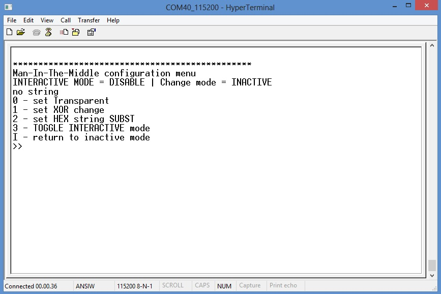

.. index:: using

.. _gs:

Getting started Babylon A70CM
-----------------------------

This chapter contain a brief of **Stand Alone operation mode** of Babylon application. More detail can be found in :ref:`more`

.. _saset:

Hardware setup
**************

Before use the application firmware, you must connect SerizII with its own Babylon board, as in figure below

.. image:: _static/board_setup.jpg

When connected, you have 2 serial ports.

- one VCOMM port (need FTDI drivers) using FDTI.
- one VCOMM port (need a CDC driver - Babylon_1_0.zip file include driver folder named "USB CDC binaries") being implemented on the USB of the LPC435X on SerizII Server

All ports work at 115200,n,8,1 no handshake.

Open 1 terminal instances, connected to the MINI USB (FDTI). This is the Server and Client main menu.
This VCOMM is immediate active as soon as the powered on.

When power up ends, SerizII display will show:

The VCOMM connected to the Micro USB is activated only after the Babylon has completed its initialization (this will ends when FTDI terminal instance show the Babylon main menu, it takes about 10” after power on). Wait to open the Micro USB Vcomm port till the SerizII has completed initialization.

On the instance connected to MINI USB (FDTI), after the initialization is complete, the babylon A70CM main menu will be displayed

By pressing '1' you enter in the **configuration sub-menu**

This menu will enable:

* select the AES key lengh ( '1' = 128, '2' = 256 bits )
* enable encryption only ( '3' ), or encrypted and signed ( '4' )
* toggle verbose mode for more details during data exchange
* reset main configuration parameter to default set
* return to main menu ( 'm' go to main menu )

Man-In-The-Middle menu
^^^^^^^^^^^^^^^^^^^^^^

As soon as you open the instance connected to the “Man-In-The-Middle” (micro USB on Babylon SerizII), this will be displayed

When all the Terminal are activated, you are ready to start evaluation!!

.. _auth:

First steps
***********

First of all, you must set key lengh in configuration sub menu. 

Type '1' from main menu, then select '1' for 128, '2' for 256 (see image above)

**To start a work session and enable messages sending, it's mandatory to perform Authentication process.**
To do this, you must start the Authenticate operations. Press '2' from main menu:

when Authentication ends

* a few messages are exchanged between the Server and Client tasks, and the messages are shown on the Babylon terminal as soon as the messages arrives and start from each task.
* by default the “Man-In-The-Middle” is INACTIVE; you can see the status of each actor (Babylon and “Man-In-The-Middle”) on the top of the menu display.
* here below an example of Babylon state when Authentication success

When INACTIVE, no messages are sent to "Man-In-The-Middle" task. It will be ignored.

* The “Man-in-the-middle” go to the ACTIVE state when you select how it works, as:
	* transparent, doing nothing on the messages.
	* interactive change mode: when a message is received, the “Man-in-the-middle”, the message is stored in the “Man-In-The-Middle” buffer waiting action made using the menu.
	* automatic change mode: when a message is received by the “Man-in-the-middle” it is changes based on the change type selected.
	
* When the “Change” mode is active (either interactive or automatic), the message is modified based on the selection made (by selection on the “Man-In-The-Middle” menu)
	* 0, set no change
	* 1, change by XORing some characters with a specified character string
	* 2, change by changing some characters with a specified character string
	* When in “automatic mode” selected, any incoming message is changed and sent to the destination
	* When in “interactive mode” (key '3' toggle this mode ), the message is stored, waiting for the “Man-In-The-Middle” operator to decide what to do with the message, The message is sent when the action is defined, and “CR” is pressed.
	
Sendig messages
***************

*Available only when Babylon is in "Authenticated and connected state". See image below*

The demo can start by leaving the “Man-In-The-Middle” inactive (default after reset).
After autentication process ends succesfully, by selecting to send a message:

* select '3' on the “Babylon main menu"
* write an ascii string
* when the “return” key is pressed, the message is encrypted and sent by Babylon Server tesk; received, decrypted by Babylon Client task and shown on the Babylon terminal. 

.. note:

 | **The AES encryption key used for encryption is exchanged during the authentication phase.**
 | **send/receive message use RTOS queue from/to the two A70CM mounted on Babylon add-on board**
 

| Then, the “Man-In-The-Middle” can be activated, pressing '3' on its menu.
| When a message is sent from Babylon Server task, the message is now received and shown on the “Man-In-The-Middle” terminal.
| Pressing Return, the received message is sent with no modification to Babylon Client task and shown on the Babylon terminal.
| The message can also be changed by the “Man-In-The-Middle” and the result is shown on the Babylon terminal.
| 

.. _lanset:

Hardware setup LAN mode
***********************
All functionality described in this paragraph can be performed using Babylon firmware compiled for LAN mode. 
**Because Server and Client are on two separate board, each one has to be programmed compiling firmware with its own defines** :ref:`macros`

Before use the application firmware, you must connect 2 SerizII, each with its own Babylon board, as in figure below

When connected, you have 3 serial ports.

- two VCOMM port (need FTDI drivers) using FDTI, one from each SerizII.
- one VCOMM port (need a CDC driver) being implemented on the USB of the LPC435X on SerizII Server

The serizII which will show on the display **“Babylon IP client”** has only a single USB VCOMM connected to the mini USB (this port will use FTDI driver) and show a Client menu interface;

The serizII which will show on the display **“Babylon IP server”** has two USB connected, the Mini port is the Server menu interface (this port will use FTDI driver), and a micro USB which is connected to the “Man-in-the-middle” process (this port will need a CDC driver);

All ports work at 115200,n,8,1 no handshake.

Open 2 terminal instances, one for each VCOMM connected to the MINI USB (FDTI).
There VCOMM are immediate active as soon as the powered on.

The VCOMM connected to the Micro USB is activated only after the Babylon Server SerizII has completed its initialization; wait to open this port till the SerizII has completed initialization (about 10” after power on).

On both instance connected to the IP Server and IP Client, after the initialization is complete, the A70CM main menu will be displayed

